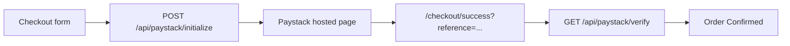
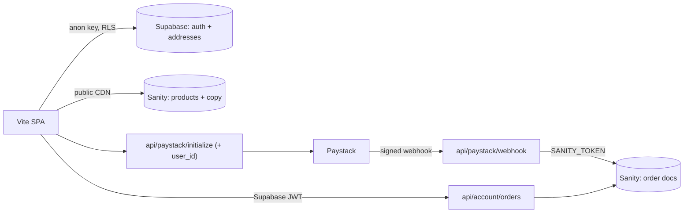

# AYRO — Project roadmap

Single source of truth for project phases. Live site: [cole-roan.vercel.app](https://cole-roan.vercel.app)

| Phase | Focus | Status |
|-------|--------|--------|
| **Phase 1** | Storefront + CMS + forms | Complete — optional: confirm Sanity→Vercel webhook |
| **Phase 2** | Paystack checkout (ZAR) | Test mode live; waiting on Paystack compliance + live keys |
| **Phase 3** | Customer accounts | Auth foundation built (Supabase) — hidden until env keys are set |

---

## Phase 1 — Soft launch (storefront + CMS)

**Goal:** The client can run the store and update content without touching code.

### Delivered

- Full storefront: Home, Shop, Product detail, About, Contact, Custom Orders, Cart
- Sanity CMS (project `xilnix6x`) for products and Site Settings
- Formspree for contact and custom-order form emails
- Vercel deploy at `https://cole-roan.vercel.app`
- Dark mode, logo intro splash, ZAR pricing
- Scroll-to-top and back-to-top navigation

### Remaining (ops, not code)

- [x] Invite client as **Editor** in Sanity — see [HANDOFF.md](HANDOFF.md)
- [x] Hosted studio URL: **https://ayro.sanity.studio** (deployed)
- [ ] Sanity → Vercel deploy webhook — confirm wired — see [HANDOFF.md](HANDOFF.md) §1
- [x] Production smoke test — see [DEPLOY.md](DEPLOY.md) §5
- [ ] Formspree: client verifies email; route notifications via Workflow

---

## Phase 2 — Paystack payments

**Goal:** Real checkout in South African Rand. Test mode now; live keys when client completes Paystack compliance.

### Delivered

- `POST /api/paystack/initialize` — creates Paystack transaction, returns redirect URL
- `GET /api/paystack/verify` — confirms payment on success page
- ZAR totals with shipping (R99, free over R1 000)
- Checkout + success pages wired end-to-end
- Editable bag on checkout (quantity and remove without leaving the page)
- Verified on **localhost:3056** (`npm run dev:api`) and **production** (test mode)

### Remaining before fully live

- [x] Privacy Policy and Returns pages (`/privacy`, `/returns`)
- [ ] Client completes Paystack compliance (Owner + Account sections)
- [ ] Swap Vercel `PAYSTACK_SECRET_KEY` from `sk_test_...` to `sk_live_...`
- [ ] One live payment smoke test
- [ ] Optional: Paystack webhook + server-side order storage (today: verify-on-return only)

See [DEPLOY.md](DEPLOY.md) for env vars, test cards, and handoff checklist.

---

## Phase 3 — Customer accounts (in progress)

**Goal:** Returning customers can log in and manage their relationship with the store.

### Architecture (decided)

| Concern | Where | Why |
|---------|-------|-----|
| Identity & sessions | **Supabase Auth** (`@supabase/supabase-js`) | Managed auth for a Vite SPA — no custom JWT/password code |
| Saved addresses | **Supabase Postgres** (per-user table, RLS) | PII stays behind row-level security; pre-fills checkout |
| Order records | **Sanity `order` documents**, written server-side via Paystack webhook + `SANITY_TOKEN` | Merchant sees orders in the studio they already use; never client-readable |
| Order history API | `GET /api/account/orders` — verifies Supabase JWT, queries Sanity by `user_id`/email | Orders stay server-side; SPA never holds a Sanity write token |
| Products & copy | **Sanity** (unchanged) | CMS stays content-only — no users or PII in the content lake |

### 3.1 Auth foundation — delivered

- `src/lib/supabase.ts` — client; **null when `VITE_SUPABASE_*` env vars are missing**, so the site runs guest-only with zero account UI (same graceful degradation as Sanity/Formspree)
- `src/context/AuthContext.tsx` — session restore, `signIn` / `signUp` / `signOut`, `updateProfile`
- `api/lib/auth.ts` + `GET /api/auth/me` — server-side JWT verification when Supabase is configured
- `/login`, `/signup`, and `/account` (profile + placeholders), guarded by `ProtectedRoute`
- Navbar shows **Log in / Account** only when auth is configured
- Checkout pre-fills email/name for signed-in customers and sends `userId`; `api/paystack/initialize` adds `user_id` to Paystack metadata so the future webhook can link orders to accounts. **Guest checkout is unchanged.**
- `supabase/schema.sql` — `customer_profiles` + `saved_addresses` with RLS (orders live in Sanity, not Postgres)

To enable: create a Supabase project, run `supabase/schema.sql`, then set `VITE_SUPABASE_URL`, `VITE_SUPABASE_ANON_KEY`, `SUPABASE_URL`, and `SUPABASE_SERVICE_ROLE_KEY` in Vercel + `.env.local`.

### 3.2 Remaining scope

| Feature | Plan |
|---------|------|
| Order storage | `api/paystack/webhook.ts` — verify `x-paystack-signature` (HMAC-SHA512), create Sanity `order` doc; add `order` schema to studio |
| Order history | `GET /api/account/orders` (JWT-verified) + orders list on `/account` |
| Saved addresses | Supabase `saved_addresses` CRUD on `/account`, pre-fill checkout |
| Wishlist | Supabase table keyed by user; replaces `localStorage`-only saves |

### Prerequisites

Phase 2 live payments plus the Paystack webhook (3.2) so order history has data to display.

---

## Local development

| Command | URL | Use for |
|---------|-----|---------|
| `npm run dev` | http://localhost:5173 | Frontend only (no checkout API) |
| `npm run dev:api` | http://localhost:3056 | Checkout + Paystack API routes |

Requires `.env.local` with Sanity, Formspree, and `PAYSTACK_SECRET_KEY` — see [DEPLOY.md](DEPLOY.md).
