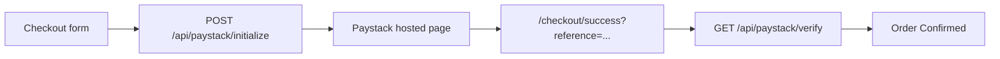
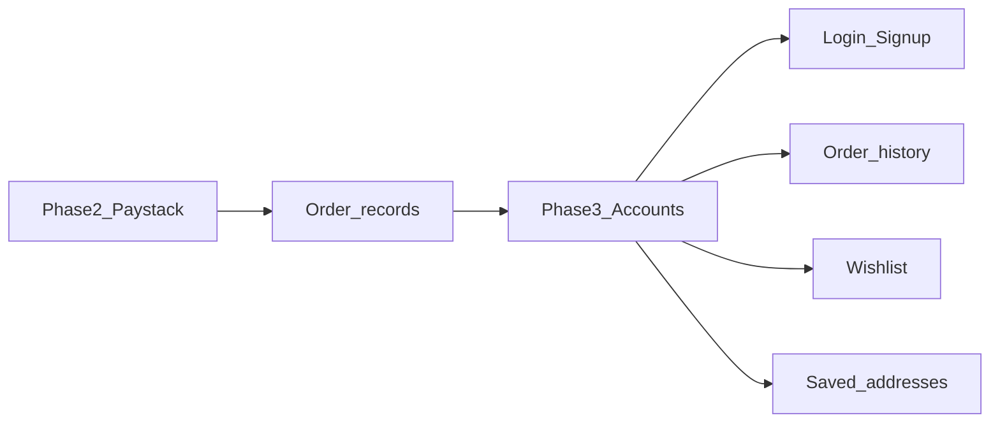

# AYRO — Project roadmap

Single source of truth for project phases. Live site: [cole-roan.vercel.app](https://cole-roan.vercel.app)

| Phase | Focus | Status |
|-------|--------|--------|
| **Phase 1** | Storefront + CMS + forms | ~complete |
| **Phase 2** | Paystack checkout (ZAR) | Legal pages done; live keys + Paystack compliance remain |
| **Phase 3** | Customer accounts | Not started |

---

## Phase 1 — Soft launch (storefront + CMS)

**Goal:** The client can run the store and update content without touching code.

### Delivered

- Full storefront: Home, Shop, Product detail, About, Contact, Custom Orders, Cart
- Sanity CMS (project `xilnix6x`) for products and Site Settings
- Formspree for contact and custom-order form emails
- Vercel deploy at `https://cole-roan.vercel.app`
- Dark mode, logo intro splash, ZAR pricing
- Scroll-to-top and back-to-top navigation

### Remaining (ops, not code)

- [ ] Invite client as **Editor** in Sanity → Members
- [ ] Share hosted studio URL (`npm run deploy` from `sanity/`)
- [ ] Sanity → Vercel deploy webhook (auto-rebuild on publish) — see [DEPLOY.md](DEPLOY.md) §4
- [ ] Production smoke test — see [DEPLOY.md](DEPLOY.md) §5

---

## Phase 2 — Paystack payments

**Goal:** Real checkout in South African Rand. Test mode now; live keys when client completes Paystack compliance.

### Delivered

- `POST /api/paystack/initialize` — creates Paystack transaction, returns redirect URL
- `GET /api/paystack/verify` — confirms payment on success page
- ZAR totals with shipping (R99, free over R1 000)
- Checkout + success pages wired end-to-end
- Verified on **localhost:3056** (`npm run dev:api`) and **production** (test mode)

### Remaining before fully live

- [x] Privacy Policy and Returns pages (`/privacy`, `/returns`)
- [ ] Client completes Paystack compliance (Owner + Account sections)
- [ ] Swap Vercel `PAYSTACK_SECRET_KEY` from `sk_test_...` to `sk_live_...`
- [ ] One live payment smoke test
- [ ] Optional: Paystack webhook + server-side order storage (today: verify-on-return only)

See [DEPLOY.md](DEPLOY.md) for env vars, test cards, and handoff checklist.

---

## Phase 3 — Customer accounts (planned)

**Goal:** Returning customers can log in and manage their relationship with the store.

**Not started** — no auth routes or libraries in the repo today.

### Planned scope

| Feature | Description |
|---------|-------------|
| Login / signup | Likely Supabase Auth (or similar provider) |
| Account area | Profile page after login |
| Order history | Link Paystack payment references (or webhook-stored orders) to user accounts |
| Saved addresses | Pre-fill checkout shipping for logged-in customers |
| Wishlist | Persist saved items beyond browser `localStorage` |

### Prerequisites

Phase 2 live payments plus order storage (Paystack webhook or database) so order history has data to display.

---

## Local development

| Command | URL | Use for |
|---------|-----|---------|
| `npm run dev` | http://localhost:5173 | Frontend only (no checkout API) |
| `npm run dev:api` | http://localhost:3056 | Checkout + Paystack API routes |

Requires `.env.local` with Sanity, Formspree, and `PAYSTACK_SECRET_KEY` — see [DEPLOY.md](DEPLOY.md).
